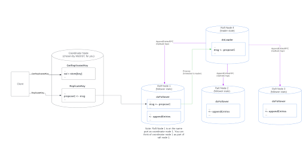
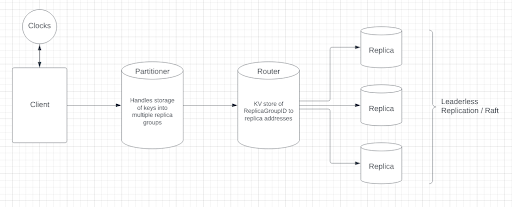

# Modist
[](https://skillicons.dev)

Store your data on Modist, a document-based Daas(Database as a service) that support docker deployment.

For more detail, please read this [developer blog](https://xjhao.studio/02/25/2023/modist/).

Docker swarm supporting on the way...

Created by Yutong Li(yli195) and Xingjian Hao(xhao9). Backup and updated from private reporsitory.

## What is is
Modist, or Modular Distributed Storage, is a distributed databse that supports multiple synchoronization model setups for each functionality domain. Common issues for distributed systems are addressed with proven solutions from academia and industry. 

Modist is built with BoltDB, gRPC, and Protobuf. The system overall applies a raft schema, and each nodes meantained local replication and partitioning for data safety.





## Known Issues
Please check Issue tab for more information.

## Usage

Modist docker image is available at [here]().

Usage of Modist Docker Image:

```shell
docker pull PTJohn0122/modular_distributed_storage_go:latest
```

While docker is provided as general solution, modist also provide local package for development and integration. To use,

```shell
git clone https://github.com/PTJohn0122/Modular_Distributed_Storage.git
go build
```